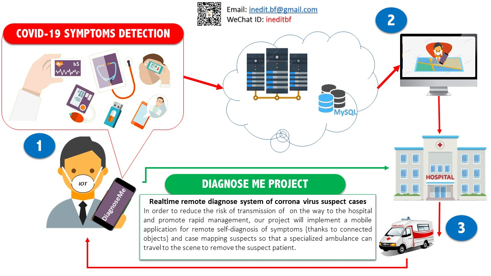


# ABOUT PROJET

# DiagnoseMe (en)
Diagnosis and geolocation platform  in real time for suspected cases of COVID-19

In order to reduce the risk of transmission of  on the way to the hospital and promote rapid management, our project will implement a mobile application for remote self-diagnosis of symptoms (thanks to connected objects) and suspected case mapping  so that a specialized ambulance can travel to the scene to remove the suspected patient.
   

# Main Fonctions
FAQ on COVID-19 (HELP)
Remote Diagnose
Get the constants of the user using captors and make the diagnosis
Prevention (TIPS)
Geolocation and Management of the suspected cases by Hospital 
Hospital Notification

# About DiagnoseMe ?
A remote self-diagnosis of symptoms and suspected cases mapping and notification.

# What is DiagnoseMe ?
After a travel or presence on public place
1. Click on "DiagnoseMe";
2. Enter your age, location and contact;
3. Follow the different tests requested with phone and captors;
4. Get your results.
If the test results is positive. Do not worry an ambulance will come and assist you for further examination.Stay home.
If the test results is nagative see preventions guide.

# PROJET PRESENTATION

Format: 
Please see logo.jpg below
# TEAM COMPOSE
Please see powerpoint and video file below

